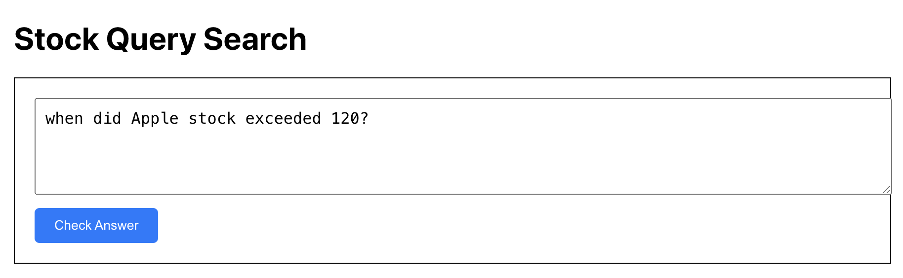
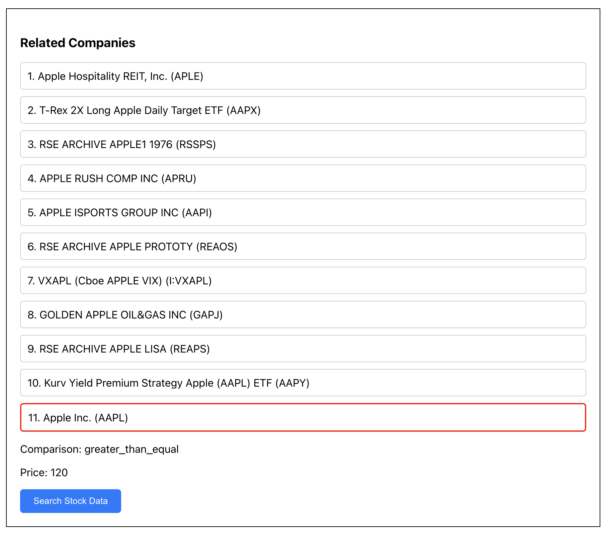
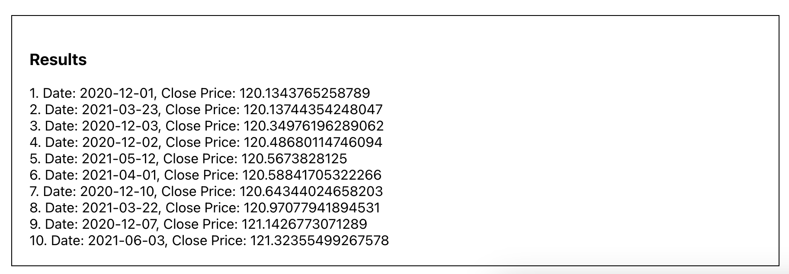

# KRX - Frontend

### 1. Login ###

- After logging in, the user is automatically redirected to `/serach`

### 2. Sign Up ###

- To send a requeset Django `/auth/user` endpoint, the following 4 fields are required

    ```
    {
        "email": "",
        "username": "",
        "password": "",
        "re_password": ""
    }
    ```

### 3. Stock Query ###

- Step 1

    The use inputs a question in natural language (ENG). From this, the company name, ticker symobl, and the stock price are extracted

    

- Step 2

    A list of similar company names is displayed.

    For exmaple, if the user searches for 'Apple', they may see companies like 'Apple Hospitality', 'Apple' etc.

    To select the correct company, the ticker symbol is shown next to each company

    

- Step 3

    Using the accurate data selected above, the desired stock information is retrieved using `yfinance`

    